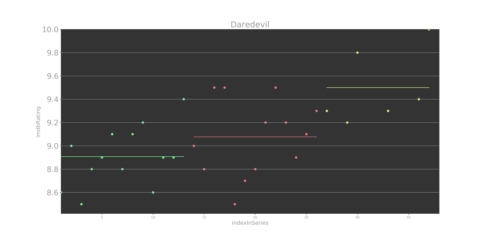

## Sample Command-Line Usage
```
python omdbapi --id tt0491738
```

## Sample API Usage
```
from omdbapi import OmdbApi, graphics
api = OmdbApi(omdb_api_key)
response = api.find("daredevil")
response.summary()
```
Output:
```
MediaResource('series', 'Daredevil')
 	imdbId:      tt3322312
 	year(s):     2015–
 	duration     PT54M
 	imdbRating:  8.7
 	Plot:        A blind lawyer by day, vigilante by night. Matt Murdock fights the crime of New York as Daredevil.
	 SeasonResource(S1 - Daredevil)
		 EpisodeResource(S01E01 - Into the Ring)
		 EpisodeResource(S01E02 - Cut Man)
		 EpisodeResource(S01E03 - Rabbit in a Snowstorm)
		 EpisodeResource(S01E04 - In the Blood)
		 EpisodeResource(S01E05 - World on Fire)
		 EpisodeResource(S01E06 - Condemned)
		 EpisodeResource(S01E07 - Stick)
		 EpisodeResource(S01E08 - Shadows in the Glass)
		 EpisodeResource(S01E09 - Speak of the Devil)
		 EpisodeResource(S01E10 - Nelson v. Murdock)
		 EpisodeResource(S01E11 - The Path of the Righteous)
		 EpisodeResource(S01E12 - The Ones We Leave Behind)
		 EpisodeResource(S01E13 - Daredevil)
	 SeasonResource(S2 - Daredevil)
		 EpisodeResource(S02E01 - Bang)
		 EpisodeResource(S02E02 - Dogs to a Gunfight)
		 EpisodeResource(S02E03 - New York's Finest)
		 EpisodeResource(S02E04 - Penny and Dime)
		 EpisodeResource(S02E05 - Kinbaku)
		 EpisodeResource(S02E06 - Regrets Only)
		 EpisodeResource(S02E07 - Semper Fidelis)
		 EpisodeResource(S02E08 - Guilty as Sin)
		 EpisodeResource(S02E09 - Seven Minutes in Heaven)
		 EpisodeResource(S02E10 - The Man in the Box)
		 EpisodeResource(S02E11 - .380)
		 EpisodeResource(S02E12 - The Dark at the End of the Tunnel)
		 EpisodeResource(S02E13 - A Cold Day in Hell's Kitchen)
	 SeasonResource(S3 - Daredevil)
		 EpisodeResource(S03E01 - Resurrection)
		 <--missing-->
		 EpisodeResource(S03E03 - No Good Deed)
		 EpisodeResource(S03E04 - Blindsided)
		 <--missing-->
		 <--missing-->
		 EpisodeResource(S03E07 - Aftermath)
		 <--missing-->
		 <--missing-->
		 EpisodeResource(S03E10 - Karen)
		 EpisodeResource(S03E11 - Reunion)
```

Plot the ratings for each episode:
```
from omdbapi.graphics import SeriesPlot
SeriesPlot(response)
```




## Available Objects


##### MediaResource:
- `actors`: str
- `awards`: str
- `country`: str
- `director`: str
- `duration`: timetools.Duration
- `genre`: str
- `imdbId`: str
- `imdbRating`: float
- `imdbVotes`: int
- `language`: str
- `metascore`: float
- `plot`: str
- `rating`: str
- `ratings`: List[Dict[str, str]]
- `releaseDate`: timetools.Timestamp
- `responseStatus`: bool
- `title`: str
- `type`: str
- `writer`: str
- `year`: str


